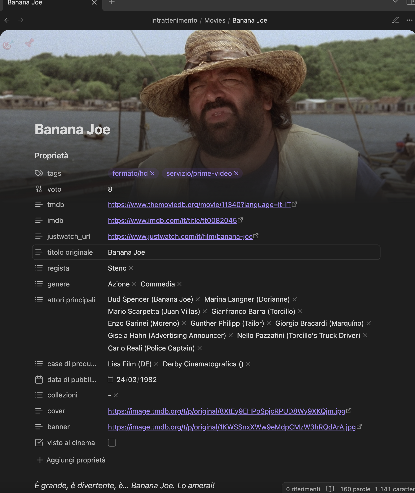
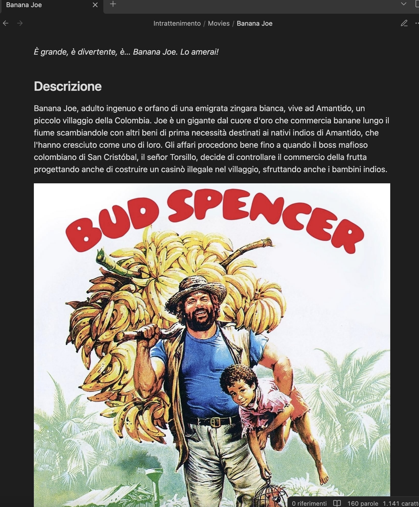
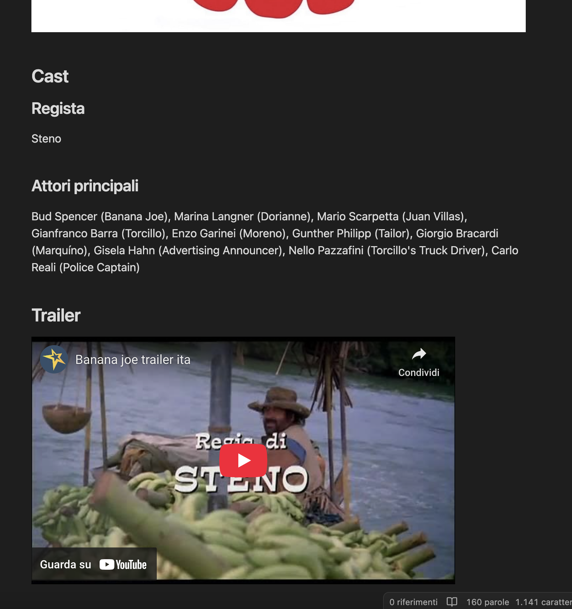
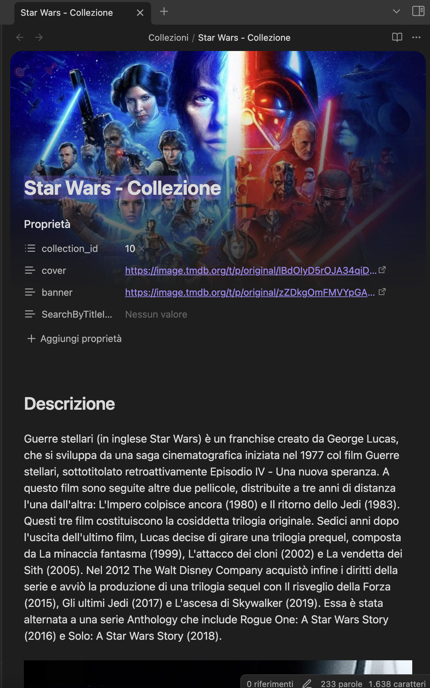
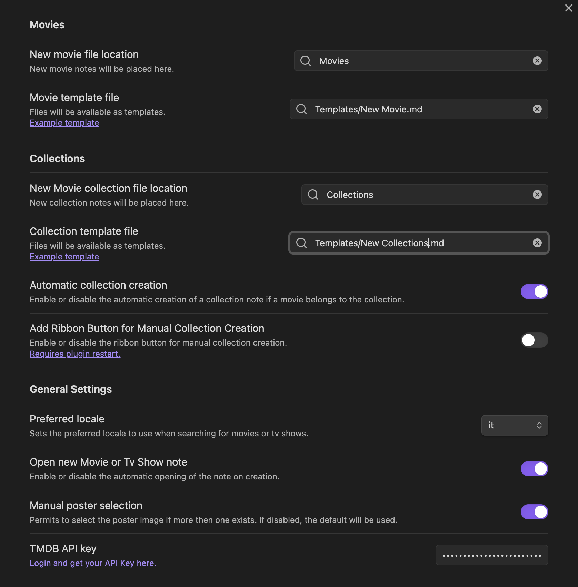

# Movie Companion
_Organize your movie collection privately._


Movie Companion is an Obsidian plugin that allows you to organize your private movie collection in a private way accessible only to you.

## Features

- Search for movies and retrieve information from TMDB (The Movie Database)
- Create a note for each movie with its metadata, cover, and backdrop (for use with a banner plugin)
- Retrieve or calculate id for some popular external movie services (IMDB, TMDB, JustWatch)
- Automatically detect and link movie collections
- Freely organize movies and collections in folders
- Customizable note templates

## Changelog

See [CHANGELOG.md](CHANGELOG.md).

## Prerequisites
1. Obtain an API key from TMDB and configure it in the plugin settings.

## Installation

1. Install the "Movie Companion" plugin in Obsidian.
2. Obtain an API key from TMDB and configure it in the plugin settings.

### Install From Community Plugins (recommended)

Click the link to install the plugin from the official community search engine: [Install Link](https://obsidian.md/plugins?id=movie-companion)

Alternatively, you can search for the plugin directly from Obsidian.

### Manual installation

1. Clone the repository to your Obsidian plugins folder (`.obsidian/plugins`).

```bash
git clone https://github.com/ats4e/obsidian-movie-companion.git
```

2. Install the dependencies.

```bash
npm install
```

3. Build the plugin.

```bash
npm run build
```

4. Reload Obsidian and enable the plugin in the settings.

## Recommended Plugins Integration

No one of this plugin is required but are strongly recommended.

- [Dataview](https://github.com/blacksmithgu/obsidian-dataview)
- [Pixel Banner](https://github.com/nothingislost/obsidian-pixel-banner)
- [Meta Bind](https://obsidian.md/plugins?id=obsidian-meta-bind-plugin)


## Usage Examples







*Example of a movie note created by the plugin*


*Example of a collection note created by the plugin*

## Configuration

In the plugin settings, you can configure:

- TMDB API key
- Default folder for movie and collection notes
- Custom note templates (see examples below)
- Automatic collection 
- Locale for movie information (default is Obsidian's locale)
- Automatically create collections for movies
- Manually select movie poster


*Plugin settings screen*

## Example Note Templates

Here some examples for templating your notes.

### Movie Note Template

```markdown
---
tmdb: https://www.themoviedb.org/movie/{{id}}?language=it
imdb: https://www.imdb.com/it/title/{{imdb_id}}
justwatch_url: https://www.justwatch.com/it/film/{{justwatch_id}}
titolo originale: "{{original_title}}"
director:
  - "{{director}}"
genres:
  - "{{genres}}"
main actors:
  - "{{main_actors}}"
companies:
  - "{{production_companies}}"
release date: "{{release_date}}"
collections:
  - "{{collection_id}}"
cover: "{{poster_path}}"
banner: "{{backdrop_path}}"
---

*{{tagline}}*

## Description

{{overview}}


## Cast

### Director

{{director}}

### Main Actors

{{main_actors_string}}

## Trailer


```

### Collection Note Template

*In this case, I've used the Meta Bind Plugin to perform a Search By Title.*

````markdown
---
collection_id: "{{id}}"
cover: "{{poster_path}}"
banner: "{{backdrop_path}}"
SearchByTitleInput: ""
---

## Descrizione

{{overview}}


## Films

```meta-bind
INPUT[text(placeholder(Search By Title...)):SearchByTitleInput]
```

```dataview
TABLE WITHOUT ID
	"" as Cover,
	link(file.link, Title) as Title,
	dateformat(release-date, "yyyy") as "Release Date",
	genres + "" as "Genres"
FLATTEN collections AS collection
WHERE 
collection = this.collection_id
AND (this.SearchByTitleInput = "" OR contains(lower(file.name), lower(this.SearchByTitleInput)))
SORT dateformat(release-date, "yyyy") Asc
```
````

## Template Variables

Put a variable in your template, it will be replaced with the value

| Variable                          | Type     | Description                             |
| --------------------------------- | -------- | --------------------------------------- |
| `{{id}}`                          | number   | TMDB movie ID                           |
| `{{name}}`                        | string   | Renderable name                         |
| `{{media_type}}`                  | string   | Type of media                           |
| `{{original_title}}`              | string   | Original movie title                    |
| `{{release_date}}`                | string   | Release date                            |
| `{{title}}`                       | string   | Movie title                             |
| `{{poster_path}}`                 | string   | Path to the poster image                |
| `{{backdrop_path}}`               | string   | Path to the backdrop image              |
| `{{main_actors}}`                 | string[] | Main actors list                        |
| `{{main_actors_string}}`          | string   | Main actors as a string                 |
| `{{director}}`                    | string   | Movie director                          |
| `{{genres}}`                      | string[] | List of genres                          |
| `{{genres_string}}`               | string   | Genres as a string                      |
| `{{homepage}}`                    | string   | Movie homepage URL                      |
| `{{imdb_id}}`                     | string   | IMDB ID                                 |
| `{{justwatch_id}}`                | string   | JustWatch ID                            |
| `{{original_language}}`           | string   | Original language                       |
| `{{overview}}`                    | string   | Movie overview                          |
| `{{popularity}}`                  | number   | Popularity score                        |
| `{{production_companies}}`        | string[] | List of production companies            |
| `{{production_companies_string}}` | string   | Production companies as string          |
| `{{production_countries}}`        | string[] | List of production countries            |
| `{{production_countries_string}}` | string   | Production countries as string          |
| `{{spoken_languages}}`            | string[] | List of spoken languages                |
| `{{spoken_languages_string}}`     | string   | Spoken languages as string              |
| `{{tagline}}`                     | string   | Movie tagline                           |
| `{{vote_average}}`                | number   | Average vote                            |
| `{{vote_count}}`                  | number   | Number of votes                         |
| `{{collection_id}}`               | string   | Collection ID (if part of a collection) |
| `{{youtube_url}}`                 | string   | YouTube trailer URL                     |
| `{{posters.file_path}}`           | string   | Poster file path                        |
| `{{posters.vote_average}}`        | number   | Poster vote average                     |
| `{{posters.vote_count}}`          | number   | Poster vote count                       |

## License

This project is licensed under the [MIT License](https://github.com/ats4e/obsidian-movie-companion/blob/master/LICENSE.md).

## Contributing

If you find any issues or have suggestions for improvements, please feel free to open a new issue on the [GitHub repository](https://github.com/ats4e/obsidian-movie-companion/issues/new).

## Support

If you find this plugin useful, you liked it, and would like to support its development, you can buy me a coffee:

<a href="https://www.buymeacoffee.com/ats4edev" target="_blank"></a>